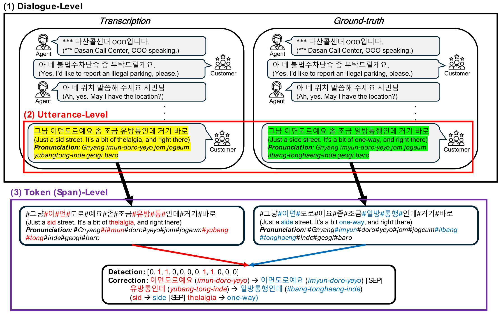

# DCSC: Detector-Gated Contextual Span Correction for Korean ASR Post-Editing

<p align="center">
  <strong>Engineering Applications of Artificial Intelligence</strong>
</p>

<p align="center">
  
</p>

DCSC is a text-only post-editing framework for Korean ASR transcripts in an **error-sparse**
setting, where most utterances a modern STT system produces are already correct. A KoELECTRA
detector tags errors at the **token** level and gates a corrector; the corrector reads the
flagged utterance together with its **dialogue context** and emits **span-level** edits
(`오류span -> 정정span [SEP] ...`, or `이상없음` for no error) instead of rewriting the sentence.
Predicting edits and gating on detection are what keep already-correct utterances intact.

This repository keeps the dataset and the method code. Splits, checkpoints and metrics are
regenerated under `data/splits/` and `runs/`.

## Dataset

**DasanCallDial** — 1,974 real civil-complaint call dialogues (115,460 utterances) to the
120 Dasan Call Foundation, transcribed by a production ASR system and manually corrected.
Numbers and identifying information are masked (`***`, `OOO`).

The dataset is **not distributed in this repository**. It is licensed
[CC BY-NC 4.0](https://creativecommons.org/licenses/by-nc/4.0/) (non-commercial research
only), which differs from this repository's MIT code license, so it is published separately
on the Hugging Face Hub. **Download it before running anything:**

```bash
pip install -U huggingface_hub
hf download <hub-user>/DasanCallDial --repo-type dataset \
    --local-dir data/dasancalldial
```

The result must be exactly these three files:

```text
data/dasancalldial/
├── train.csv
├── val.csv
└── test.csv
```

Every utterance is already partitioned at the **dialogue** level (0.80/0.05/0.15, so no
dialogue is shared between subsets). Each row carries the dialogue key, the speaker
(`rec_mode`: `tx` = counselor, `rx` = customer), the ASR transcription, the ground truth and
its position in the dialogue.

| | dialogues | utterances | dedup. samples | error rate |
|---|---:|---:|---:|---:|
| train | 1,579 | 91,355 | 50,470 | 17.5 % |
| validation | 98 | 5,418 | 3,157 | 15.0 % |
| test | 297 | 18,687 | 11,088 | 18.2 % |
| **total** | **1,974** | **115,460** | **64,715** | **17.5 %** |

The partition ships with the dataset, so results do not depend on a local split. It can be
re-derived from a source workbook with `--xlsx` (`--split_seed`, default 77, controls it and
is independent of the training seed).

Using the dataset, or any model trained on it, means accepting the CC BY-NC 4.0
non-commercial terms.

## Repository layout

```text
CallCenter_Revision/
├── dcsc/                   # edits, data, context, detector, correctors, pipeline, metrics, config
├── scripts/                # prepare_data, train_detector, train_corrector, evaluate, run_*.sh
├── data/dasancalldial/     # DasanCallDial; NOT in Git -- download from the Hub (see Dataset)
├── data/splits/            # Deduplicated utterance level; generated by prepare_data.py
└── runs/                   # Generated at runtime; ignored by Git
```

## Setup

```bash
conda create -n dcsc python=3.8 -y && conda activate dcsc
pip install -r requirements.txt
```

Results were produced with `torch 2.4.1+cu121`, `transformers 4.46.3` and `peft 0.13.2` on
NVIDIA RTX 6000 Ada GPUs. Select a GPU with `CUDA_VISIBLE_DEVICES=N`.

## 1. Prepare the data

Download the dataset into `data/dasancalldial/` first (see [Dataset](#dataset)); this step
fails without it.

```bash
python scripts/prepare_data.py
```

Deduplicates `data/dasancalldial/` inside each partition and writes `data/splits/` plus
`split_statistics.json`. Dialogue context is rebuilt from the released partition, so both
locations are read during training and evaluation.

## 2. Train the detector

```bash
python scripts/train_detector.py --seed 42
```

KoELECTRA token classification with the erroneous class up-weighted (λ = 8). An utterance is
forwarded when at least one token fires above `--detector_threshold` (0.5). Validation F1 is
nearly flat across epochs while precision/recall moves a lot, so `--metric_for_best`
(`f1`, `utt_recall`, …) selects the operating point; the trajectory is saved to
`val_history.json`.

## 3. Train the corrector

```bash
python scripts/train_corrector.py --variant full --backbone pkot5 --seed 42 \
  --detector_dir runs/detector_seed42/best
```

`--variant` selects how much of DCSC is enabled and `--backbone` selects the corrector
(`pkot5` = `paust/pko-t5-base`, `llama` = `meta-llama/Llama-3.1-8B-Instruct` + LoRA).

| `--variant` | context | target | detector gate |
|---|---|---|---|
| `u` | – | full sentence | – |
| `s` | – | span string | – |
| `con_s` | ✓ | span string | – |
| `full` (= `dcsc`) | ✓ | span string | ✓ |

For `full`, the detector is first applied to the training set so its false positives enter
the corrector's data (`--curation fp_aware`, or `balanced` to sample the error-free half at
random).

## 4. Evaluate

```bash
python scripts/evaluate.py --variant full --backbone pkot5 --seed 42 \
  --detector_dir runs/detector_seed42/best \
  --corrector_dir runs/corrector_pkot5_full_seed42/best
```

Detection is scored as an utterance-level binary decision (*did the system modify the
utterance?*) with Precision/Recall/F1/Acc/**Bal-Acc**; correction with **EM**, **Bal-EM** and
WER split into **N-WER** (clean), **E-WER** (erroneous) and their mean **Bal-WER**. Balanced
variants matter because roughly four out of five test utterances are already correct.

`--variant zero_rule` scores the untouched ASR output and needs no model.

## Outputs

```text
runs/
├── detector_seed<seed>/best/                       # detector checkpoint + val_history.json
├── corrector_<backbone>_<variant>_seed<seed>/best/ # corrector checkpoint
└── eval_<backbone>_<variant>_seed<seed>_<split>/
    ├── metrics.json
    └── predictions.csv
```

`scripts/run_dcsc.sh <seed> <backbone> <gpu>` runs steps 1–4, `scripts/run_ablation.sh` walks
`u → s → con_s → full`, and `scripts/aggregate_seeds.py` turns several runs into a
mean ± std table.

## Pre-trained models

Weights exceed GitHub's file-size limit, so they are not in this repository. Train them with
the steps above, or point `--detector_dir` and `--corrector_dir` at a local snapshot of a
published one. `scripts/upload_checkpoints.py` publishes a checkpoint to the Hub.

Weights trained on DasanCallDial inherit the dataset's CC BY-NC 4.0 non-commercial terms.

## Verification and notes

```bash
scripts/pilot_test.sh 0          # every code path on a few hundred rows, minutes
python scripts/evaluate.py --variant zero_rule
```

- Training context is the ground-truth history; at inference it is filled autoregressively
  with the model's own previous corrections, so context variants decode sequentially.
- Span edits are replace-only: an error that only requires deleting a word cannot be
  expressed, and a span occurring twice is rewritten at both positions. Applying gold spans
  recovers 98.9 % of erroneous training utterances, the ceiling of this design.
- Metrics are computed on the deduplicated split while context is rebuilt from the released
  partition, so `scripts/evaluate.py` reads `--split_dir` and `--dataset_dir`.

## License

The **code** in this repository is under the [MIT License](LICENSE).

The **DasanCallDial** dataset is *not* distributed here. It is published on the Hugging Face
Hub under [CC BY-NC 4.0](https://creativecommons.org/licenses/by-nc/4.0/) and may be used
for non-commercial research only. Model weights trained on it inherit that restriction.

The fine-tuned backbones carry their own upstream licenses; see the THIRD-PARTY MODELS
section of [LICENSE](LICENSE).

## Citation

```bibtex
@article{jun2025dcsc,
  title   = {Leveraging Fine-grained Error Correction in Korean Speech Recognition
             for Consultation Services},
  author  = {Jun, Yonghyun and Lee, Jimin and Chang, Hwan and Shin, Dongho and
             Kim, Seolah and Lee, Hwanhee},
  journal = {Engineering Applications of Artificial Intelligence},
  year    = {2025}
}
```

Data were provided by the 120 Dasan Call Foundation. Supported by the Chung-Ang
University Graduate Research Scholarship in 2025 and by an IITP grant funded by MSIT
(RS-2021-II211341, Artificial Intelligence Graduate School Program, Chung-Ang University).
